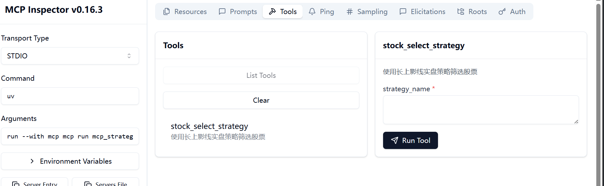

1. 创建MCP文件 如下

   ```
   from mcp.server.fastmcp import FastMCP

   # 创建mcp server
   mcp = FastMCP("使用长上影线实盘策略筛选股票")

   @mcp.tool()
   def stock_select_strategy(strategy_name: str) -> dict:
       """
       使用长上影线实盘策略筛选股票
       """
       from FinanceAstockAgent.MCP.strategyupper.strategyupper import run_strategy
       return run_strategy(strategy_name)
   ```
2. 调试MCP服务器 （提前安装UV python -m pip install uv）

   ```
   mcp dev xxx.py
   ```

- 以上启动后会出现一个控制台网页 先点击Connect 连接， tools界面可以看到所需的tools
