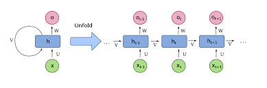

- 《Attention is All You Need》核心创新点：Transformer架构和Self- Attention自注意力机制

阅读思路：

1. 以往的模型的结构和处理逻辑，它们存在的问题/瓶颈——— 结构为什么会导致瓶颈？
    1. 涉及1，2节：Introduction & Background
2. 论文中创新性提出的模型结构，这样的结构解决了什么问题，为什么可以解决之前的瓶颈？
    1. 核心：Transformer架构和Self- Attention自注意力机制
    2. 涉及3，4节：Model Architecture & Why Self-Attention

## 序列转导模型 Sequence Transduction Model

- 什么是序列转导模型
    - 处理序列数据的模型
    - 序列数据：具有顺序关系的数据，每个元素的顺序对于数据的整体含义非常重要。
    - 典型的序列转导任务：
        - 文本翻译
        - 文本生成
        - 语音转文字

## Transformer和以往模型的区别

- 以往模型：
    - 主流基于RNN / CNN （RNN作为主流，CNN探索）
    - 基于encoder-decoder结构
    - 使用attention mechanism 注意力机制增强
- Transformer
    - 完全摒弃RNN/CNN
    - 依然是Encoder-Decoder结构
    - 完全基于注意力机制

## 历史模型发展

### FNN（前馈神经网络）

- 为什么不适合序列转导任务
- Input维度固定，对于不同长度的句子处理效率低下。如果INPUT词向量进行平均，完全丢失了词语的顺序，如果进行拼接，需要一个足够大的INPUT维度，而且还是将句子作为一个整体来处理，无法理解“先后”的语义关系。

### RNN （循环神经网络）

- RNN解决的问题
    - 能够建模词序：RNN是按时间顺序（Token顺序）逐个处理输入的。
    - 能够建模上下文依赖：RNN是逐个喂入词语，并且会有“记忆”机制。
    - 支持不定长输入：不再需要FNN那种固定长度的输入格式，句子多长都可以。
- 模型如下图

- 简述：
    - Xt：t时间的输入
    - Ht：t时间的状态
    - Yt：t时间的输出
    - U， V， W：训练的权重矩阵
    - Ht = g（WXt + UHt-1）
    - Yt =  g（VHt）
    - Ht中的g：激活函数，如ReLU，sigmod，用于引入非线性，增强表达能力；同时限制数值范围，避免梯度爆炸/消失。
    - Yt中的g：视任务而定，比如如果是分类问题，可能是SoftMax函数，用于把输出转成概率分布。

### 编码器-解码器架构

- 解决输入输出不等长问题
- 把RNN上半部分和下半部分拆开来
- 存在的问题
    - “遗忘”问题：因为Encoder是把整句话内容处理后输出向量C（结果）让Decoder处理，所以越前的信息遗忘的越快，随着序列长度的增长，，远距离依赖信息在传递过程中易被稀释，导致模型对长距离依赖关系的建模能力减弱。
    - “重要性”问题：在输出的时候，所有时间步的输入在计算当前时刻的OUTPUT的时候被同等对待，忽略了不同时间步对当前时刻输出的重要性可能存在的差异。

### Attention机制

- 解决遗忘问题
- 解决重要性问题
- 通过分配不同权重

### 串行问题

- RNN依然需要串行计算，无法实现并发计算。需要h1，h2，…，ht依次输出结果，因为T步的结果依赖于T-1步。
